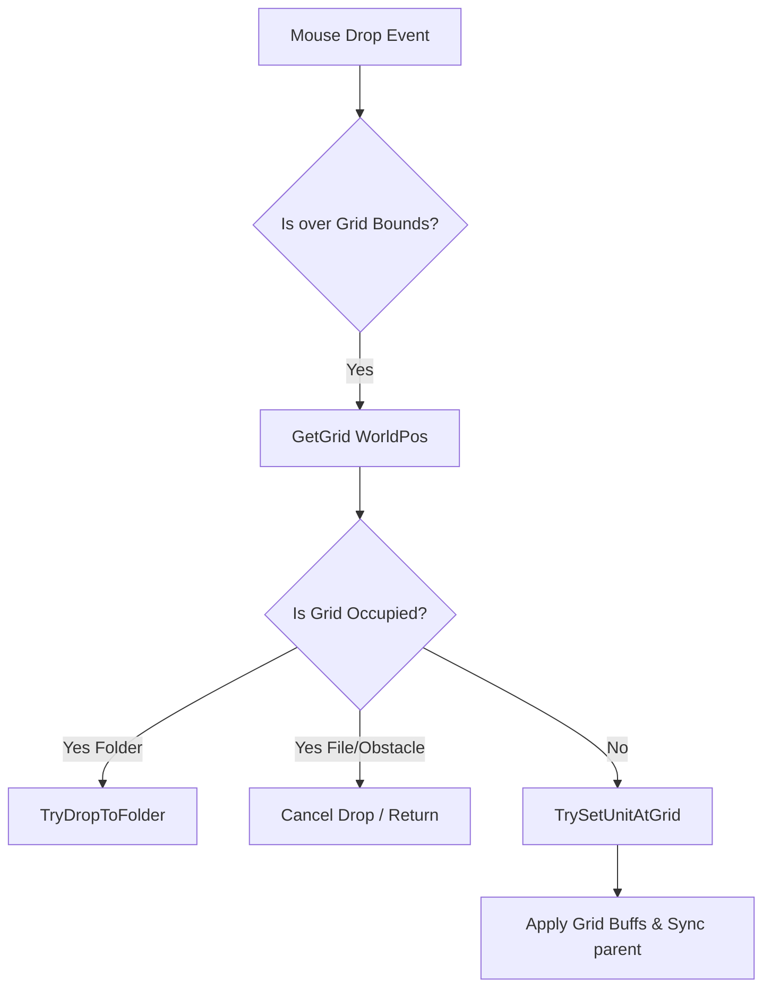

# 기술 포트폴리오 기획안: 파일 타워 디펜스 (File Tower Defence)
> **본 기획안은 수집된 C# Unity 소스 코드를 심층 분석하여, 포트폴리오 웹사이트에 서술할 핵심 기술 항목과 아키텍처 분석 내용을 정리한 문서입니다.**

---

## 1. 프로젝트 개요 (Concept)
* **핵심 콘셉트**: OS 파일 시스템(파일, 폴더, 바이러스, 백신)을 모티브로 한 그리드 기반 타워 디펜스 게임.
* **주요 특징**: 일반적인 타워 디펜스와 달리 유닛(파일)을 드래그앤드롭하여 배치하거나, 폴더(Unit_Folder) 내부에 패킹(Zip)하여 보관하고, 바이러스에 의해 실시간으로 파일이 감염되어 기능이 변하는 유기적인 시스템을 특징으로 함.

---

## 2. 핵심 기술 필러 (4 Key Pillars) 분석 및 서술 전략

### 📂 Pillar 1. FileGrid 기반 객체 배치 및 폴더 패킹 시스템
그리드 좌표와 월드 좌표 간의 정밀한 변환, 그리고 파일 시스템 특유의 **'폴더 내 파일 드롭(Zip/Unzip)'** 메커니즘을 구현한 핵심 공간 관리자입니다.



* **포트폴리오 서술 핵심**:
  1. **그리드-월드 좌표 역산 및 탐색 최적화**: 
     - 월드 좌표를 그리드 인덱스로 변환하는 `WorldToGridIndex` 로직 및 범위 밖 드롭 시 가장 가까운 그리드를 O(1)~O(9) 범위 내에서 고속 탐색하는 `FindClosestGridInRange` 최적화 구조 설명.
  2. **계층 구조(Hierarchy) 기반 폴더 패킹 (Zip/Unzip)**:
     - 일반 유닛 배치뿐만 아니라, [FileGridManager.cs](file:///C:/Ptf/InfiSword.github.io/codeReference/file_tower_defence/FileGridManager.cs)의 `HandleDropAt`에서 드롭된 대상이 폴더(`Unit_Folder`)일 경우 `TryDropToFolder`를 통해 폴더 윈도우 내부 파일 목록으로 유닛의 소속을 계층적으로 이관하는 메커니즘 강조.
  3. **메모리 및 렌더링 최적화 (GPU 부담 최소화)**:
     - [FileGrid.cs](file:///C:/Ptf/InfiSword.github.io/codeReference/file_tower_defence/FileGrid.cs)에서 하이라이트 렌더링 시 매 그리드마다 독립된 Material을 생성하지 않고, **정적 리소스 공유(`static _sharedHighlightMaterial`)** 및 **`MaterialPropertyBlock`**을 활용하여 드로우 콜(Draw Call)과 메모리 낭비를 방지한 배치 최적화 기법 소개.

---

### 🖱️ Pillar 2. One Euro Filter를 적용한 고급 입력 시스템
렌즈 왜곡 효과가 존재하는 화면에서 드래그 조작 시 발생하는 미세 노이즈와 떨림을 수학적 필터링으로 극복한 사용자 경험(UX) 최적화 사례입니다.

* **포트폴리오 서술 핵심**:
  1. **Lens Distortion 보정으로 인한 좌표 증폭 문제**:
     - 화면 왜곡 보정 셰이더나 연산(`LensDistortionCorrector.MousePosition`)을 거치면 마우스의 미세한 물리적 떨림이 비선형적으로 증폭되어 드래그 중인 오브젝트가 미세하게 요동치는 UX 결함 발생.
  2. **1€ 필터 (One Euro Filter) 도입을 통한 신호 스무딩**:
     - [InputManager.cs](file:///C:/Ptf/InfiSword.github.io/codeReference/file_tower_defence/InputManager.cs)에 `OneEuroFilter2D` 클래스를 직접 구현하여 적용.
     - **원리**: 포인터 신호가 느리게 움직이거나 멈춰 있을 때는 저역 통과 필터(Low-pass filter)의 차단 주파수(Cutoff Frequency)를 낮춰 떨림을 강력히 억제하고, 빠르게 드래그할 때는 차단 주파수를 높여 반응 속도 지연(Lag)을 최소화함.
  3. **상태 머신 기반 입력 분기 및 범위 선택**:
     - `InputState` (None, Pressing, DraggingObject, DraggingBox) 정의를 통한 정밀한 조작 제어.
     - `Physics2D.OverlapAreaAll`을 활용한 RTS 스타일의 드래그 박스 다중 유닛 선택 구현.

---

### ⚡ Pillar 3. 컴포넌트 생명주기 기반 동적 버프 시스템
버프 데이터를 단순 수치 리스트로 관리하는 기존 방식에서 벗어나, **Unity의 컴포넌트(Component) 시스템을 데코레이터 패턴처럼 활용**하여 높은 확장성을 확보한 설계입니다.

```
[GameObject: Unit]
    ├── Unit_File (Status: Attack, Speed, etc.)
    └── BuffController (Manager)
            ├── AddComponent<Buff_AttackSpeed> (Instance ID: 101)  <-- Dynamic Attachment
            └── AddComponent<Buff_DamageBoost> (Instance ID: 102)
```

* **포트폴리오 서술 핵심**:
  1. **컴포넌트 주입형 버프 아키텍처**:
     - [BuffController.cs](file:///C:/Ptf/InfiSword.github.io/codeReference/file_tower_defence/BuffController.cs)에서 버프 적용 시 `gameObject.AddComponent(skillType)`을 통해 실제 버프 효과 클래스(예: `Buff_Base` 상속 객체)를 객체에 동적으로 부착.
     - **장점**: 버프 자체의 타이머, 연출 이펙트, 생명주기 관리를 Unity 엔진 고유의 `Update` 및 `OnDestroy` 흐름에 완벽히 위임하여 메인 스크립트의 결합도(Coupling)를 극도로 낮춤.
  2. **실시간 스탯 합산 및 변경 전파**:
     - 버프가 추가되거나 제거될 때 `GetComponents<Buff_Base>()`를 호출하여 특정 버프 타입의 합산 수치를 실시간 계산하고, `_owner.FileSetStat()`을 통해 유닛 스탯을 즉각 동기화하는 견고한 데이터 흐름 구축.

---

### 🦠 Pillar 4. 런타임 컴포넌트 주입식 바이러스 감염 시스템
바이러스가 플레이어의 시스템 코어인 `MyCom`에 도달했을 때, 필드 위의 유닛들을 오염시키고 행동 방식을 오염원 콘셉트에 맞춰 동적으로 변조하는 시스템입니다.

* **포트폴리오 서술 핵심**:
  1. **동적 행위 오염 (Decorator Pattern 및 컴포넌트 확장)**:
     - [VirusInfectionAbility.cs](file:///C:/Ptf/InfiSword.github.io/codeReference/file_tower_defence/VirusInfectionAbility.cs)는 바이러스가 `MyCom`에 충돌할 시 필드의 정상 파일 중 하나를 타겟팅하여 `WormInfection`, `RansomwareInfection` 등의 컴포넌트를 런타임에 동적으로 주입.
     - **감염 유형별 행위 제어**:
       - **랜섬웨어(Ransomware)**: 파일의 공격 기능을 잠그고(Lock) 격리 상태로 변경.
       - **웜(Worm)**: 인접한 그리드의 다른 정상 파일로 감염을 자가 복제하여 전파.
  2. **인터페이스 기반 다형성 설계**:
     - `IInfectable` 인터페이스를 통해 파일 유닛뿐만 아니라 시스템 요소들이 동일한 규격으로 감염 상태 및 백신(치료) 로직을 수행할 수 있도록 유연하게 설계됨.

---

## 3. 포트폴리오 페이지 구성안 (Layout)

포트폴리오 사이트([index.html](file:///C:/Ptf/InfiSword.github.io/index.html)) 또는 신규 생성할 서브 페이지에 아래와 같은 구조로 배치하면 인사담당자에게 매우 강한 인상을 줄 수 있습니다.

### 1️⃣ 인트로 및 시각 자료 (Hero Section)
* **타이틀**: *OS File System Concept Tower Defence: 파일 타워 디펜스*
* **핵심 요약**: "Unity 컴포넌트 시스템을 극대화하여 버프와 감염 시스템을 모듈화하고, 1€ 필터 알고리즘으로 왜곡 화면에서의 드래그 조작 계수를 혁신한 클라이언트 기술 포트폴리오"
* **데모 영상/GIF**: 폴더 패킹(Zip), 다중 드래그 선택, 바이러스 감염 전파 연출 등을 담은 10초 내외의 루핑 GIF.

### 2️⃣ 기술 상세 분석 탭 (Technical Deep-Dive)
* **Tab 1: FileGrid & Packing**
  - **내용**: 그리드 레이아웃 공식 및 폴더 드롭 이관 코드 구조 설명.
  - **시각자료**: 그리드와 월드 좌표계 매핑 관계도 및 폴더 트리 다이어그램.
* **Tab 2: One Euro Filter Input**
  - **내용**: 렌즈 왜곡에 따른 신호 노이즈 그래프 수식 제시 및 1€ 필터 적용 전/후의 마우스 좌표 떨림 비교 그래프.
  - **코드 하이라이트**: `OneEuroFilter2D.Filter()` 핵심 수학 공식 및 적용 코드.
* **Tab 3: Component-based Buffs**
  - **내용**: `BuffController`가 동적으로 컴포넌트를 붙이고 떼는 흐름도 제시. 기존 List 방식 대비 가독성 및 유지보수성 이점 수치화.
* **Tab 4: Virus Infection**
  - **내용**: `IInfectable`과 `VirusInfectionAbility`를 활용한 런타임 데코레이터 구조 다이어그램.

### 3️⃣ 트러블 슈팅 & 최적화 (Troubleshooting)
* **이슈**: 렌즈 왜곡 효과 하에서 드래그 시 마우스 노이즈가 증폭되어 드래그 중인 유닛이 화면에서 심하게 떨리던 현상.
* **해결**: 단순 보간(Lerp)은 조작 레이턴시(지연)를 유발하므로, 속도에 반응하는 **One Euro Filter** 알고리즘을 도입하여 멈춰있을 때의 차단 주파수를 낮추고 움직일 때 높임으로써 지연율 0%에 수렴하는 부드러운 드래그 구현 성공.
* **최적화**: 수백 개의 그리드 하이라이트 인스턴스가 렌더링될 때 발생하는 메모리 낭비를 막기 위해 `static Material` 공유 및 `MaterialPropertyBlock`을 적용하여 가비지 컬렉션(GC) 및 드로우 콜을 최소화함.

---
> **Tip**: 해당 포트폴리오에 적용할 수 있는 대화형 시뮬레이션(예: 마우스 입력 필터링 체감 캔버스 등)을 직접 웹용으로 구현하여 포트폴리오 페이지에 임베딩하면 시각적 효과를 극대화할 수 있습니다.
