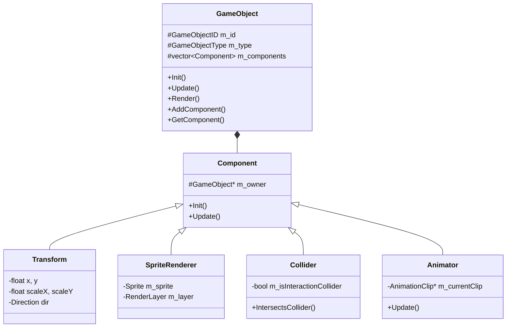
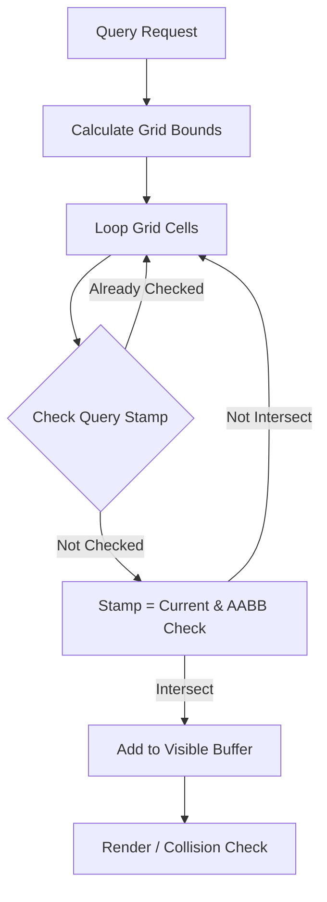
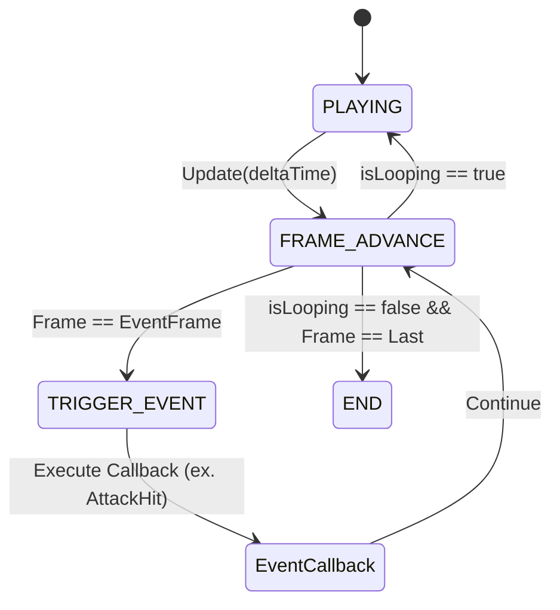

C++와 WinAPI를 활용하여 'Don't Starve'의 핵심 메커니즘을 모사하고, 대규모 객체 환경에서의 성능 최적화를 연구한 프로젝트입니다.

## 1. 프로젝트 개요
- **개발 기간**: 2025. 12. 05 ~ 2026. 02. 04 (약 2개월)
- **개발 환경**: C++, WinAPI
- **목표**: 대규모 오브젝트가 존재하는 환경에서 안정적인 프레임을 유지하며, 생존 및 전투 루프가 완전한 게임 구현.

## 2. 주요 시스템 아키텍처

### 2.1 컴포넌트 기반 객체 설계 (Component-Based)
단일 상속의 복잡성을 피하고 객체 지향적인 유연성을 극대화하기 위해 **컴포넌트 기반 구조**를 채택했습니다. 모든 게임 객체(`GameObject`)는 기능 단위의 컴포넌트를 소유하며, 실행 시점에 필요한 기능을 동적으로 탈부착할 수 있습니다.



이러한 구조를 통해 새로운 객체를 생성할 때 상속 계층에 얽매이지 않고 유연하게 기능을 조립할 수 있습니다.

```cpp
// GameObject.h - 컴포넌트 추가 및 획득 핵심 로직
template <typename T, typename... Args>
T* AddComponent(Args&&... args) {
    auto newComponent = std::make_unique<T>(this, std::forward<Args>(args)...);
    T* componentPtr = newComponent.get();
    m_components.push_back(std::move(newComponent));
    return componentPtr;
}

template <typename T>
T* GetComponent() const {
    for (const auto& component : m_components) {
        if (!component) continue;
        T* target = dynamic_cast<T*>(component.get());
        if (target) return target;
    }
    return nullptr;
}
```

### 2.2 중앙 집중식 매니저 패턴 (Singleton Managers)
시스템의 전역적인 상태 관리와 자원 공유를 위해 **싱글톤 기반 매니저**들을 구축했습니다.
- **ObjectManager**: 모든 객체의 생명주기 관리 및 공간 분할 그리드 업데이트.
- **RenderManager**: 렌더링 명령 예약 및 레이어별 정렬 출력.
- **ResourceManager**: 비트맵 및 스프라이트 시트 자원의 캐싱 및 중복 로드 방지.
- **CameraManager**: 카메라 이동, 가시 영역 컬링 및 좌표 변환(World <-> Screen).

## 3. 핵심 기술 및 최적화 전략

### 3.1 렌더링 파이프라인 및 Y-Sorting
GDI+를 기반으로 한 **커맨드 패턴 렌더링 파이프라인**을 구현했습니다.

```mermaid
sequenceDiagram
    participant GameObject
    participant SpriteRenderer
    participant RenderManager
    participant Graphics (GDI+)
    
    GameObject->>SpriteRenderer: Render()
    SpriteRenderer->>RenderManager: AddWorldObjectCommand(zOrder = worldY)
    Note over RenderManager: 매 프레임 레이어별 DrawCommand 저장
    RenderManager->>RenderManager: Flush()
    RenderManager->>RenderManager: Y-Sorting (std::stable_sort by zOrder)
    RenderManager->>Graphics (GDI+): ExecuteDrawCommand()
```

Top-down 뷰의 입체감을 위해 객체의 발밑(Pivot) 위치의 Y 좌표를 기준으로 정렬하여 출력함으로써 오브젝트 간의 앞뒤 관계를 정확히 표현합니다.

```cpp
// RenderManager.cpp - Y-Sorting 및 일괄 렌더링 처리
void RenderManager::Flush(Gdiplus::Graphics* pGraphics)
{
    if (!pGraphics) return;

    for (int i = LAYER_TILE_BACKGROUND; i < LAYER_COUNT; ++i) {
        if (m_layerCommands[i].empty()) continue;

        if (m_layerCommands[i].size() > 1) {
            // zOrder(Y좌표)를 기준으로 오름차순 정렬하여 뒤에 있는 객체가 먼저 그려지도록 함
            std::stable_sort(m_layerCommands[i].begin(), m_layerCommands[i].end(), [](const DrawCommand& a, const DrawCommand& b) {
                if (a.zOrder != b.zOrder) return a.zOrder < b.zOrder;
                return a.layer < b.layer;
            });
        }

        for (const auto& cmd : m_layerCommands[i]) {
            ExecuteDrawCommand(pGraphics, cmd);
        }
        m_layerCommands[i].clear();
    }
    m_hasFrameCameraPos = false;
}
```

### 3.2 공간 분할 기법: 그리드 기반 컬링 (Grid-based Culling)
월드에 수천 개의 오브젝트가 존재할 때의 렌더링 및 충돌 처리 성능 저하를 방지하기 위해 **공간 분할(Spatial Partitioning)** 기법을 적용했습니다.



매 프레임 카메라의 현재 Viewport 영역에 해당하는 그리드 셀 내의 객체들만 추출하여 업데이트 및 렌더링을 수행합니다. 객체가 여러 셀에 겹쳐있을 경우 중복 처리를 막기 위해 **쿼리 스탬프(Query Stamp)** 기법을 활용했습니다.

```cpp
// ObjectManager.cpp - 공간 분할 기반 객체 쿼리
void ObjectManager::QueryObjectsInRectArea(const Gdiplus::RectF& rectArea, std::vector<GameObject*>& targetOutObjects)
{
    if (m_worldObjects.empty()) return;

    // 뷰포트 기반 그리드 인덱스 계산
    int startX = (int)floor(rectArea.X / GRID_CELL_SIZE);
    int startY = (int)floor(rectArea.Y / GRID_CELL_SIZE);
    int endX = (int)ceil((rectArea.X + rectArea.Width) / GRID_CELL_SIZE) - 1;
    int endY = (int)ceil((rectArea.Y + rectArea.Height) / GRID_CELL_SIZE) - 1;

    // 인덱스 범위 클램핑 (생략) ...

    // 중복 방지용 스탬프 갱신
    if (++m_spatialQueryStamp == 0) m_spatialQueryStamp = 1;

    for (int y = startY; y <= endY; ++y) {
        for (int x = startX; x <= endX; ++x) {
            for (auto* obj : m_spatialGrid[x][y]) {
                // 이미 확인한 객체는 건너뜀 (Stamp-based Optimization)
                if (obj->GetLastSpatialQueryStamp() == m_spatialQueryStamp) continue;
                obj->SetLastSpatialQueryStamp(m_spatialQueryStamp);

                if (!obj->IsEnabled() || obj->IsDead()) continue;

                // 최종 AABB 정밀 검사
                const Gdiplus::RectF bounds = obj->GetBounds();
                if (rectArea.X < bounds.X + bounds.Width && rectArea.X + rectArea.Width > bounds.X &&
                    rectArea.Y < bounds.Y + bounds.Height && rectArea.Y + rectArea.Height > bounds.Y) {
                    targetOutObjects.push_back(obj);
                }
            }
        }
    }
}
```

### 3.3 애니메이션 시스템 및 프레임 이벤트
`Animator`와 `AnimationClip`을 통한 고도로 제어 가능한 애니메이션 시스템을 구축했습니다. 프레임 이벤트를 통해 애니메이션 시점과 코드 로직을 동기화합니다.



애니메이션의 특정 프레임(예: 공격이 닿는 순간)에 이벤트를 바인딩하여 무기 데미지를 주거나 사운드를 재생할 수 있습니다.

```cpp
// Animator.cpp - 프레임 이벤트 처리 로직
// 프레임 변경 시, 건너뛴 프레임 포함해 지나친 모든 프레임에 대해 이벤트 발생
if (currentFrameIndex != -1 && currentFrameIndex != m_lastTriggeredFrame)
{
    if (m_owner) m_owner->SetSpatialDirty();
    const std::map<int, std::wstring>& eventFrames = m_currentClip->GetEventFrames();
    const AnimationEventCallback& callback = m_currentClip->GetEventCallback();

    int startIdx = m_lastTriggeredFrame + 1;
    int endIdx = currentFrameIndex;

    AnimationClip* pCurrentClipBeforeCallback = m_currentClip;

    for (int fi = startIdx; fi <= endIdx && callback; ++fi ) {
        auto eventIt = eventFrames.find(fi);
        if (eventIt != eventFrames.end())
        {
            callback(fi, eventIt->second); // 등록된 콜백 실행 (공격 판정, 사운드 등)

            // 콜백 내부에서 상태 변경(예: 사망 등)으로 애니메이션이 바뀌었는지 확인
            if (pCurrentClipBeforeCallback != m_currentClip) {
                return;
            }
        }
    }
    m_lastTriggeredFrame = currentFrameIndex;
}
```

## 4. 데이터 로드 및 게임 진행 정보 저장

### 4.1 데이터 주도 설계 (Data-Driven)
게임의 밸런스 조정과 콘텐츠 확장을 용이하게 하기 위해 외부 데이터를 적극 활용합니다. 맵 파일뿐만 아니라, 오브젝트의 피벗(Pivot) 및 콜라이더 사이즈도 외부 텍스트 파일(`object_resource_overrides.txt`)을 파싱하여 동적으로 덮어씌웁니다.

```cpp
// DataManager.cpp - 오브젝트 리소스 및 콜라이더 데이터 오버라이드
void DataManager::Init()
{
    // ... 기본 데이터 설정 생략 ...

    // object_resource_overrides.txt 로드 후 id별 pivot/콜라이더 덮어쓰기
    ResourcePathUtils::ParseObjectResourceOverridesFile(L"GameData/object_resource_overrides.txt",
        [this](GameObjectID id, const ResourcePathUtils::ObjectResourceDef& overrideDef) {
            auto it = m_objectResources.find(id);
            if (it != m_objectResources.end()) {
                it->second.pivotX = overrideDef.pivotX;
                it->second.pivotY = overrideDef.pivotY;
                it->second.hasCollider = overrideDef.hasCollider;
                it->second.colliderType = overrideDef.colliderType;
                it->second.colliderOffsetX = overrideDef.colliderOffsetX;
                it->second.colliderOffsetY = overrideDef.colliderOffsetY;
                it->second.colliderWidth = overrideDef.colliderWidth;
                it->second.colliderHeight = overrideDef.colliderHeight;
            }
        });
}
```

### 4.2 스냅샷 기반 저장 시스템
플레이어의 성장 상태와 게임 진행 정보를 영속적으로 관리합니다.
체력, 인벤토리 내 아이템 정보를 `PlayerStateSnapshot` 구조체로 캡슐화하여 씬 전환 및 세이브 시점에 저장합니다.

```cpp
// GameProgressManager.h - 플레이어 상태 저장 구조체
struct PlayerStateSnapshot
{
    int hp;
    int equippedSlotIndex;
    std::vector<std::pair<GameObjectID, UINT>> inventoryItems;

    PlayerStateSnapshot() : hp(100), equippedSlotIndex(-1) {}
};

// Player.cpp - 상태 저장 (씬 전환용)
PlayerStateSnapshot Player::SaveState() const
{
    PlayerStateSnapshot snapshot;
    snapshot.hp = m_hp;
    snapshot.equippedSlotIndex = m_equippedSlotIndex;

    if (m_inventory) {
        snapshot.inventoryItems = m_inventory->GetAllItemsSnapshot();
    }

    return snapshot;
}
```
또한 `GameProgressManager`를 통해 캐릭터 해금(Unlock) 상황을 `game_progress.txt`에 물리적으로 기록 및 로드하여 다음 실행 시에도 진행도가 유지되도록 구현했습니다.
