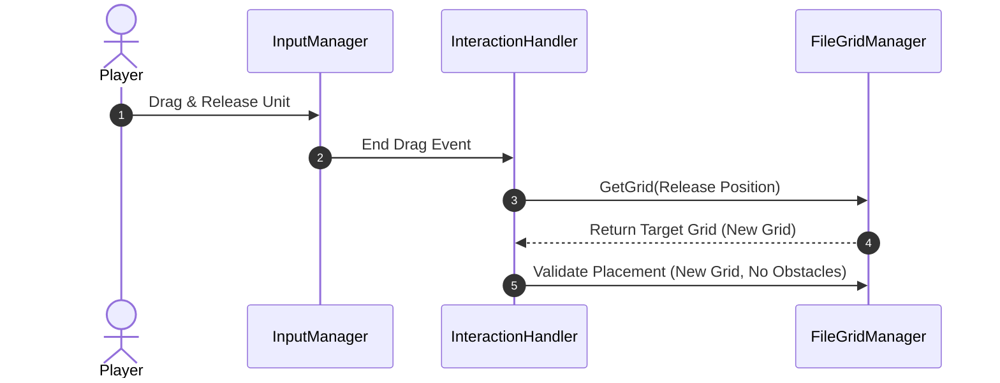
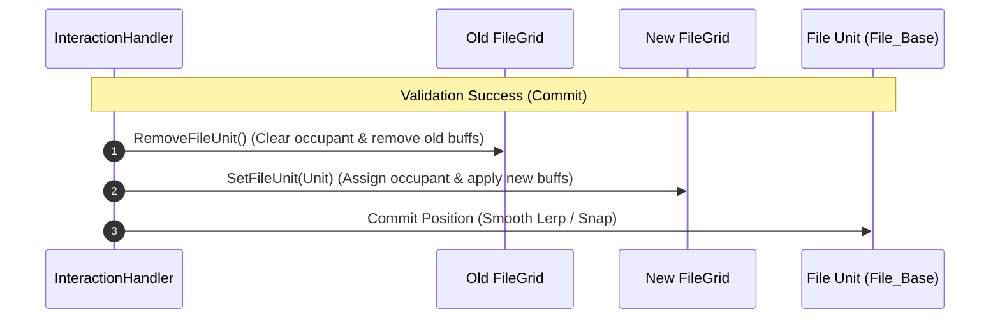
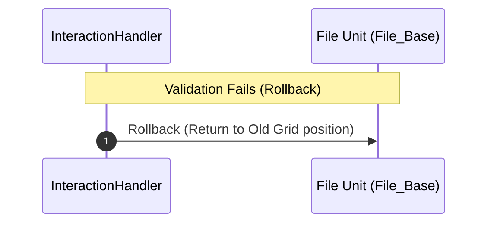
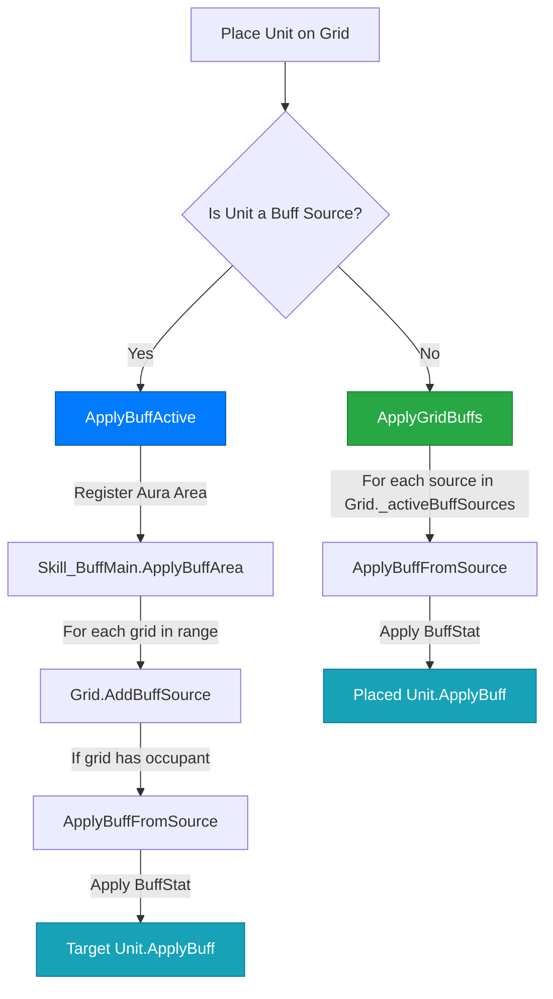

<style>
    /* --- Premium Report Layout Styles --- */
    
    .chapter-title {
        font-size: 2.2rem;
        color: #fff !important;
        background: linear-gradient(90deg, #007bff 0%, #58A6FF 100%);
        padding: 25px 35px;
        border-radius: 12px;
        margin-top: 60px !important;
        margin-bottom: 40px !important;
        box-shadow: 0 10px 30px rgba(0, 123, 255, 0.15);
        display: flex;
        align-items: center;
        border: none !important;
    }
    .chapter-title::before {
        content: "CHAPTER.";
        font-family: 'Fira Code', monospace;
        font-size: 0.9rem;
        letter-spacing: 2px;
        margin-right: 15px;
        opacity: 0.8;
    }

    .pf-visual-frame {
        width: 100%; padding: 35px; background: #fcfcfc;
        border: 1px solid #e1e4e8; border-radius: 16px;
        margin: 30px 0; text-align: center;
        box-shadow: inset 0 2px 10px rgba(0,0,0,0.02);
    }
    .pf-arch-diagram {
        display: flex; flex-direction: column; gap: 20px; margin: 25px 0;
    }
    .pf-arch-layer {
        padding: 20px 25px; border: 1px solid #e1e4e8; border-radius: 8px;
        background: #fff; position: relative; text-align: center;
        box-shadow: 0 4px 12px rgba(0,0,0,0.03);
    }
    .pf-arch-layer::before {
        content: ""; position: absolute; left: 0; top: 0; bottom: 0; width: 5px;
        background: #007bff; border-radius: 8px 0 0 8px;
    }
    .pf-arch-layer-title {
        color: #007bff; font-weight: 700; margin-bottom: 10px;
        font-family: 'Fira Code', monospace; font-size: 0.95rem; text-align: center;
    }
    .pf-arch-layer-items {
        display: flex; flex-wrap: wrap; gap: 10px; margin-top: 10px; justify-content: center;
    }
    .pf-arch-item {
        padding: 6px 14px; background: rgba(0, 123, 255, 0.08);
        border: 1px solid rgba(0, 123, 255, 0.3); border-radius: 6px;
        font-size: 0.85rem; color: #0056b3; text-align: center;
    }
    .pf-diagram-grid {
        display: grid; grid-template-columns: repeat(3, 45px); gap: 8px; justify-content: center; margin: 15px 0;
    }
    .pf-grid-cell { width: 45px; height: 45px; border: 1px solid #58A6FF; opacity: 0.2; border-radius: 4px; }
    .pf-grid-cell.active { background: #58A6FF; opacity: 1; box-shadow: 0 0 15px #58A6FF; }
    .pf-grid-cell.near { border-color: #28a745; background: rgba(40, 167, 69, 0.15); opacity: 1; }
    
    .pf-logic-container {
        display: flex; flex-direction: column; gap: 10px; margin: 20px 0; text-align: left;
    }
    .pf-logic-row {
        display: grid; grid-template-columns: 120px 1fr; gap: 15px; align-items: center;
        padding: 15px; border-radius: 8px; background: #fff; border: 1px solid #eee;
    }
    .pf-logic-label {
        font-weight: 700; color: #007bff; font-family: 'Fira Code', monospace; text-align: center;
        background: rgba(0, 123, 255, 0.05); padding: 5px; border-radius: 4px;
    }

    details.pf-details {
        margin: 20px 0;
        border: 1px solid #e1e4e8;
        border-radius: 8px;
        background: #f8f9fa;
        overflow: hidden;
    }
    details.pf-details summary {
        padding: 15px 20px;
        font-weight: 700;
        color: #007bff;
        cursor: pointer;
        outline: none;
        background: #fff;
        display: flex;
        align-items: center;
    }
    .details-desc {
        padding: 15px 20px;
        background: #fff;
        color: #666;
        font-size: 0.95rem;
        border-top: 1px solid #e1e4e8;
        line-height: 1.6;
    }

    /* --- Transaction Flow --- */
    .pf-transaction-flow {
        display: flex; align-items: center; justify-content: center; font-size: 0.75rem; font-family: 'Fira Code', monospace;
        gap: 12px; flex-wrap: wrap; margin: 20px 0;
    }
    .pf-flow-step { padding: 10px 18px; border: 1px solid #e1e4e8; border-radius: 6px; background: #fff; color: #333; text-align: center; box-shadow: 0 2px 5px rgba(0,0,0,0.05); line-height: 1.4; }
    .pf-flow-arrow { color: #007bff; font-weight: bold; font-size: 1.2rem; }

    /* --- Tables --- */
    .pf-table-wrapper { display: block !important; width: 100% !important; overflow-x: auto; margin: 20px 0; border-radius: 8px; box-shadow: 0 4px 12px rgba(0,0,0,0.03); }
    .pf-data-table {
        width: 100% !important; border-collapse: collapse; font-size: 0.9rem;
        background: #fff; border: 1px solid #e1e4e8; table-layout: fixed;
    }
    .pf-data-table th {
        background: rgba(0, 123, 255, 0.08); color: #007bff;
        padding: 15px; text-align: center; font-weight: 700; border-bottom: 2px solid #e1e4e8;
        font-family: 'Fira Code', monospace;
    }
    .pf-data-table td {
        padding: 12px 15px; border-bottom: 1px solid #e1e4e8; color: #555;
        text-align: center; line-height: 1.5;
    }
    .pf-data-table tr:last-child td { border-bottom: none; }
    .pf-data-table tr:hover { background: rgba(0, 123, 255, 0.02); }

    /* Coordinate Flow */
    .pf-coord-flow {
        display: flex; gap: 15px; margin: 25px 0;
        align-items: stretch; overflow-x: auto; padding-bottom: 10px;
    }
    .pf-coord-box {
        padding: 18px; border: 2px solid #007bff; border-radius: 8px;
        background: rgba(0, 123, 255, 0.02); text-align: center; display: flex; flex-direction: column;
        justify-content: center; min-height: 110px; min-width: 190px; flex: 0 0 auto;
    }
    .pf-coord-box-title {
        color: #007bff; font-weight: 700; margin-bottom: 10px;
        font-family: 'Fira Code', monospace; font-size: 0.9rem; border-bottom: 1px solid #eee;
        padding-bottom: 8px;
    }
    .pf-coord-box-formula {
        color: #28a745; font-size: 0.75rem; font-family: 'Fira Code', monospace;
        margin-top: 8px; padding: 6px; background: rgba(40, 167, 69, 0.05); border-radius: 4px;
    }
    
    /* Comparison Boxes */
    .pf-comp-container { display: flex; justify-content: space-around; align-items: center; flex-wrap: wrap; gap: 20px; }
    .pf-comp-box { font-family: 'Fira Code', monospace; font-size: 0.8rem; border-radius: 8px; padding: 15px; min-width: 200px; text-align: left; line-height: 1.6; }
    .pf-comp-box.old { border: 1px solid #ff7b72; background: rgba(255, 123, 114, 0.05); color: #ff7b72; }
    .pf-comp-box.new { border: 1px solid #28a745; background: rgba(40, 167, 69, 0.05); color: #28a745; }
</style>

**File Tower Defense** 프로젝트의 코어 시스템 설계를 담당하며, 유니티의 좌표계 특성을 분석한 아키텍처 재설계부터 대규모 객체의 입력 처리, 동적 버프 시스템, 그리고 그리드 기반 배치 로직까지 전반적인 시스템 개선 과정을 기록한 리포트입니다.

---

## 1. 시스템 리팩토링 및 개선
{: .chapter-title }

### 1.1 UI(RectTransform)에서 GameObject(Transform) 기반 전환

초기 설계에서는 윈도우 바탕화면의 아이콘 느낌을 살리기 위해 모든 파일 유닛을 UI 시스템(`RectTransform`)으로 구축했습니다. 그러나 프로젝트가 고도화됨에 따라 다음과 같은 한계에 직면했습니다.

*   **좌표계 종속성:** 캔버스의 앵커/피벗 설정 및 해상도에 따라 월드 좌표가 상대적으로 변하여 게임 월드 내 정밀한 위치 계산과 사거리 판정이 매우 까다로움.
*   **연산 오버헤드 (Canvas Rebuilding):** 유닛의 움직임, 호버 효과, 드래그 등의 UI 요소가 갱신될 때마다 Unity 내부에서 Canvas Rebuild가 강제로 유발되어 CPU 프레임 드랍 발생.
*   **물리 엔진의 부재:** 월드 좌표 기반의 바이러스(적)와 UI 유닛 간 물리 충돌 판정을 위해 매 프레임 `Camera.WorldToScreenPoint` 등의 물리-화면 좌표 변환 함수 호출 비용 발생.

<div class="pf-visual-frame pf-comp-frame">
  <div class="pf-comp-container">
    <!-- 기존 방식 (AS-IS) -->
    <div class="pf-comp-box old">
      <div class="pf-comp-header">
        <span class="pf-comp-badge old">기존 방식 (AS-IS)</span>
        <h4 class="pf-comp-title">RectTransform (UI)</h4>
      </div>
      <ul class="pf-comp-list">
        <li>
          <span class="pf-comp-icon old">✕</span>
          <span class="pf-comp-text">앵커·피벗 기반 좌표 종속성</span>
        </li>
        <li>
          <span class="pf-comp-icon old">✕</span>
          <span class="pf-comp-text">빈번한 Canvas Rebuild 연산 부하</span>
        </li>
        <li>
          <span class="pf-comp-icon old">✕</span>
          <span class="pf-comp-text">과도한 화면-월드 좌표 변환 비용</span>
        </li>
      </ul>
    </div>

    <!-- 전환 브릿지 (REFACTORING) -->
    <div class="pf-comp-bridge">
      <span class="pf-bridge-pill">REFACTORING</span>
      <div class="pf-bridge-arrow">
        <svg width="20" height="20" viewBox="0 0 24 24" fill="none" stroke="currentColor" stroke-width="2.5" stroke-linecap="round" stroke-linejoin="round">
          <line x1="5" y1="12" x2="19" y2="12"></line>
          <polyline points="12 5 19 12 12 19"></polyline>
        </svg>
      </div>
    </div>

    <!-- 개선 방식 (TO-BE) -->
    <div class="pf-comp-box new">
      <div class="pf-comp-header">
        <span class="pf-comp-badge new">개선 방식 (TO-BE)</span>
        <h4 class="pf-comp-title">Transform (World)</h4>
      </div>
      <ul class="pf-comp-list">
        <li>
          <span class="pf-comp-icon new">✓</span>
          <span class="pf-comp-text">독립적인 절대 2D 직교 좌표계</span>
        </li>
        <li>
          <span class="pf-comp-icon new">✓</span>
          <span class="pf-comp-text">Canvas Rebuild 오버헤드 0% (완전 배제)</span>
        </li>
        <li>
          <span class="pf-comp-icon new">✓</span>
          <span class="pf-comp-text">Physics 2D 물리 엔진 및 콜라이더 직결</span>
        </li>
      </ul>
    </div>
  </div>
</div>
        


이를 해결하기 위해 모든 유닛을 **GameObject(Transform) 기반**으로 전면 교체하여 월드 좌표계로 통일하였으며, Physics2D와의 직접적인 호환성을 확보하여 불필요한 연산을 제거하고 성능을 극적으로 최적화했습니다.

### 1.2 GameObjectGridLayout: 커스텀 레이아웃 엔진

화면 해상도에 맞춰 그리드의 간격과 셀 크기를 동적으로 계산하는 레이아웃 엔진을 구축했습니다. 유니티의 기본 `GridLayoutGroup`은 UI(Canvas) 전용 컴포넌트이므로, 일반 월드 공간 GameObject를 위해 카메라 크기에 맞게 자동으로 셀 크기를 스케일링하고 하단 작업표시줄 영역을 확보하는 커스텀 컴포넌트 `GameObjectGridLayout`을 직접 개발했습니다.

<div class="pf-visual-frame">
  <div class="pf-grid" style="grid-template-columns: repeat(auto-fit, minmax(300px, 1fr)); gap: 20px; align-items: start;">
    <!-- 컴포넌트 인스펙터 설정 -->
    <div style="text-align: center;">
      
      <div style="color: #64748b; font-size: 0.85rem; margin-top: 10px; font-weight: 500; font-family: 'Fira Code', monospace; line-height: 1.5;">
        <strong>[컴포넌트]</strong> GameObjectGridLayout 인스펙터 설정<br>
        <span style="font-size: 0.8rem; color: #94a3b8;">(Columns: 14, Rows: 8, Fit To Screen: On, Bottom Offset Ratio: 0.1)</span>
      </div>
    </div>

    <!-- 실제 인게임 월드 그리드 시각화 -->
    <div style="text-align: center;">
      
      <div style="color: #64748b; font-size: 0.85rem; margin-top: 10px; font-weight: 500; font-family: 'Fira Code', monospace; line-height: 1.5;">
        <strong>[실제 그리드]</strong> 초록색 격자선 = 인게임 실제 월드 그리드<br>
        <span style="font-size: 0.8rem; color: #2563eb; font-weight: 600;">(하단 UI 여백 10% 제외 후 가용 영역 14×8 셀 자동 피팅)</span>
      </div>
    </div>
  </div>
</div>

*   **컴포넌트 중심의 유연한 제어:** 에디터 인스펙터에서 행과 열(`Columns: 14`, `Rows: 8`), 패딩 및 스페이싱을 설정하면 오르토그래픽 카메라의 가로·세로 월드 크기를 실시간 계산하여 최적의 셀 크기(`Cell Size`)를 자동으로 도출합니다.
*   **실제 초록색 그리드(World Grid) 영역:** 씬 뷰 화면에 초록색 라인으로 표시되는 격자가 **실제 인게임 파일 유닛과 바이러스가 배치·이동하는 물리적 그리드**입니다. `Bottom Offset Ratio(0.1)` 설정을 통해 하단 작업표시줄 UI 영역(약 10%)을 비워두고, 상단 가용 영역에만 정확히 14×8 격자가 피팅되도록 중심점을 자동 보정합니다.

---

## 2. 파일/바이러스/UI 입력 및 상호작용 시스템
{: .chapter-title }

수많은 유닛이 각자 `Update()`에서 마우스 충돌을 검사하는 것은 비효율적이고 관리하기 어렵다고 판단했습니다. 이를 개선하기 위해 **Mediator 패턴**을 도입하여 **InputManager**가 모든 마우스 입력을 중앙 집중식으로 수집·판정하고, 상호작용 중재자인 **InteractionHandler**가 유닛의 선택 및 드래그 상태를 통합 관리하며, **IInteractable** 인터페이스를 구현한 대상 객체에게만 이벤트를 안전하게 전파하도록 설계했습니다.

### 2.1 중앙 집중식 입력 아키텍처

<div class="pf-visual-frame pf-flowchart-frame">
  <div class="pf-flowchart">

    <!-- 0. START -->
    <div class="pf-fc-pill-start">
      <span>🖱️</span>
      <span>Mouse &amp; Touch Input</span>
    </div>

    <!-- Arrow -->
    <div class="pf-fc-arrow">
      <svg width="20" height="20" viewBox="0 0 24 24" fill="none" stroke="currentColor" stroke-width="2.5"><line x1="12" y1="5" x2="12" y2="19"></line><polyline points="19 12 12 19 5 12"></polyline></svg>
    </div>

    <!-- STEP 01: InputManager -->
    <div class="pf-fc-card pf-fc-compact">
      <div class="pf-fc-card-header">
        <h4 class="pf-fc-title">InputManager (입력 수신 &amp; 좌표 보정)</h4>
        <span class="pf-fc-badge">CONTROLLER</span>
      </div>
    </div>

    <!-- Arrow -->
    <div class="pf-fc-arrow">
      <svg width="20" height="20" viewBox="0 0 24 24" fill="none" stroke="currentColor" stroke-width="2.5"><line x1="12" y1="5" x2="12" y2="19"></line><polyline points="19 12 12 19 5 12"></polyline></svg>
    </div>

    <!-- STEP 02: 조건 판단 1 (UI 판정 & Raycast) -->
    <div class="pf-fc-decision pf-fc-compact">
      <div class="pf-fc-decision-header">
        <span class="pf-fc-decision-badge">판단 01</span>
        <h4 class="pf-fc-decision-title">Is Pointer Over UI? (UI 포인터 검사)</h4>
      </div>
      <div class="pf-fc-branch-grid">
        <!-- YES 분기 -->
        <div class="pf-fc-branch-item pf-fc-item-compact" style="border-color: #fecaca; background: #fffdfd;">
          <span class="pf-fc-tag-yes">Yes</span>
          <div class="pf-fc-branch-title" style="margin-top: 5px;">UI 우선 처리 (월드 입력 차단)</div>
        </div>
        <!-- NO 분기 -->
        <div class="pf-fc-branch-item pf-fc-item-compact" style="border-color: #bbf7d0; background: #fdfffe;">
          <span class="pf-fc-tag-no">No</span>
          <div class="pf-fc-branch-title" style="margin-top: 5px;">Raycast &amp; Sorting Order 정렬 ➔ Target 식별</div>
        </div>
      </div>
    </div>

    <!-- Arrow -->
    <div class="pf-fc-arrow">
      <svg width="20" height="20" viewBox="0 0 24 24" fill="none" stroke="currentColor" stroke-width="2.5"><line x1="12" y1="5" x2="12" y2="19"></line><polyline points="19 12 12 19 5 12"></polyline></svg>
    </div>

    <!-- STEP 03: 조건 판단 2 (InputState FSM) -->
    <div class="pf-fc-decision pf-fc-compact">
      <div class="pf-fc-decision-header">
        <span class="pf-fc-decision-badge">판단 02</span>
        <h4 class="pf-fc-decision-title">InputState 머신 판정</h4>
      </div>
      <div class="pf-fc-branch-grid">
        <!-- 1. 클릭 -->
        <div class="pf-fc-branch-item pf-fc-item-compact">
          <span class="pf-fc-tag-state">Pressing</span>
          <div class="pf-fc-branch-title" style="margin-top: 5px;">클릭 / 호버 (Threshold 검사)</div>
        </div>
        <!-- 2. 드래그 -->
        <div class="pf-fc-branch-item pf-fc-item-compact">
          <span class="pf-fc-tag-state">DraggingObject</span>
          <div class="pf-fc-branch-title" style="margin-top: 5px;">단일 유닛 드래그 (OnDrag)</div>
        </div>
        <!-- 3. 다중 선택 -->
        <div class="pf-fc-branch-item pf-fc-item-compact">
          <span class="pf-fc-tag-state">DraggingBox</span>
          <div class="pf-fc-branch-title" style="margin-top: 5px;">다중 선택 박스 (Ctrl+드래그)</div>
        </div>
      </div>
    </div>

    <!-- Arrow -->
    <div class="pf-fc-arrow">
      <svg width="20" height="20" viewBox="0 0 24 24" fill="none" stroke="currentColor" stroke-width="2.5"><line x1="12" y1="5" x2="12" y2="19"></line><polyline points="19 12 12 19 5 12"></polyline></svg>
    </div>

    <!-- STEP 04: InteractionHandler -->
    <div class="pf-fc-card pf-fc-compact">
      <div class="pf-fc-card-header">
        <h4 class="pf-fc-title">InteractionHandler (이벤트 일괄 디스패치)</h4>
        <span class="pf-fc-badge" style="background: #ecfdf5; color: #059669; border-color: #a7f3d0;">MEDIATOR</span>
      </div>
    </div>

    <!-- Arrow -->
    <div class="pf-fc-arrow">
      <svg width="20" height="20" viewBox="0 0 24 24" fill="none" stroke="currentColor" stroke-width="2.5"><line x1="12" y1="5" x2="12" y2="19"></line><polyline points="19 12 12 19 5 12"></polyline></svg>
    </div>

    <!-- STEP 05: IInteractable Objects -->
    <div class="pf-fc-card pf-fc-compact" style="border-color: #bfdbfe; background: #f8fbff;">
      <div class="pf-fc-card-header">
        <h4 class="pf-fc-title" style="color: #1d4ed8;">IInteractable Objects (OnClick / OnDrag / OnSelected 실행)</h4>
        <span class="pf-fc-badge">EXECUTION</span>
      </div>
    </div>

    <!-- Arrow -->
    <div class="pf-fc-arrow">
      <svg width="20" height="20" viewBox="0 0 24 24" fill="none" stroke="currentColor" stroke-width="2.5"><line x1="12" y1="5" x2="12" y2="19"></line><polyline points="19 12 12 19 5 12"></polyline></svg>
    </div>

    <!-- 6. END / RESULT -->
    <div class="pf-fc-pill-end">
      <span>⚡</span>
      <span>개별 객체 Update() 0% &amp; 60+ FPS 방어</span>
    </div>

  </div>
</div>

<div class="pf-visual-frame">
    
    <p style="color: #666; font-size: 0.85rem; margin-top: 10px; font-family: 'Fira Code', monospace;">[DEMO] InputManager 기반 마우스 호버 및 클릭 감지</p>
</div>

#### 객체 중첩 판정 알고리즘
마우스 아래에 여러 유닛이나 바이러스, 혹은 UI 판정이 겹쳐있을 때, 다음과 같은 우선순위 기준을 사용하여 모호함을 해결합니다.
1.  **UI 레이어 우선:** `EventSystem.current.IsPointerOverGameObject()`를 통해 UI 상호작용 우선 처리.
2.  **물리 레이어 필터링:** `Physics2D.RaycastNonAlloc`을 활용하여 쓰레기 메모리(GC Alloc) 없이 감지된 콜라이더 배열을 가져옴.
3.  **정렬 레이어(Sorting Order) 정렬:** 감지된 객체들의 `SpriteRenderer` 내 `Sorting Layer ID` 및 `Order in Layer` 값을 비교하여 카메라와 가장 가까운(최상단에 렌더링된) 오브젝트를 타깃으로 최종 선택.

### 2.2 IInteractable 인터페이스 기반 확장성

클릭 및 드래그 상호작용이 필요한 모든 인게임 오브젝트(유닛 파일, 바이러스 등)는 [IInteractable](/codeReference/file_tower_defence/IInteractable.cs) 인터페이스를 상속받아 유연하게 확장할 수 있습니다.

<div class="pf-visual-frame">
    
    <p style="color: #666; font-size: 0.85rem; margin-top: 10px; font-family: 'Fira Code', monospace;">[DEMO] IInteractable 상속 객체의 실시간 마우스 드래그 & 배치 흐름</p>
</div>

<details class="pf-details">
<summary>코드 보기: IInteractable 인터페이스</summary>

```csharp
// IInteractable.cs: 인게임 오브젝트(파일/바이러스) 통합 입력 인터페이스
public interface IInteractable
{
    GameObject targetObj { get; }
    Transform transform { get; }
    Sprite TooltipImg { get; }  // 툴팁은 클래스로 만들까 고민
    string ToolTipDes { get; }  
    
    // 선택 상태 관리
    bool IsSelectable { get; }
    bool IsDraggable { get; }
    bool IsTooltipEnabled { get; }
    
    // 이벤트 메서드
    void OnHoverEnter();     // 마우스가 객체 위로 올라올 때 (ToolTip 타이밍 리셋용)
    void OnHoverExit();      // 마우스가 객체에서 벗어날 때 (ToolTip 숨김)
    void OnClickEnter();     // 마우스 버튼을 누를 때
    void OnClickExit();      // 마우스 버튼을 뗄 때
    void OnBeginDrag();
    void OnDrag(Vector2 mouseDelta); 
    void OnEndDrag();
    void OnClick();          // 클릭 처리
    void OnDoubleClick();    // 더블클릭 처리
    void OnRightClick();     // 우클릭 처리
    void OnSelectSingle();

    // 선택 상태 표시
    void OnSelected(bool isSelected);
}
```
</details>

---

## 3. 그리드 기반 오브젝트 배치 시스템
{: .chapter-title }

### 3.1 FileGrid: 데이터 중심의 지능형 셀 매니저

[FileGrid](/codeReference/file_tower_defence/FileGrid.cs)는 단순한 위치 정보 홀더가 아니라, 유닛 배치 상태와 해당 셀에 작용 중인 오라(버프) 목록을 독자적으로 관리하는 지능형 컨테이너입니다.
*   **HashSet 기반 버프 소스 관리:** 현재 그리드 공간에 영향을 주는 버프 제공 유닛의 목록을 `HashSet<File_Base>`로 관리하여 버프의 중복 적용을 제거하고 $O(1)$의 빠른 조회 속도를 유지합니다.
*   **유닛 탈부착 시 자동 스탯 갱신:** 유닛이 배치되거나 이탈할 때 그리드에 축적된 버프 목록을 분석하여 대상 유닛의 스탯을 실시간으로 갱신해 줍니다.

### 3.2 원자적 배치 트랜잭션 (Transactional Pattern)

드래그 앤 드롭으로 유닛의 그리드 위치를 옮길 때 발생할 수 있는 데이터 불일치 및 예외 상황을 원자적으로 보장하기 위해 배치 트랜잭션 흐름을 **탐색/검증, 성공(Commit), 실패(Rollback)**의 3가지 흐름으로 분할 설계하여 안전성을 확보했습니다.

#### 1. 탐색 및 검증 단계 (Search & Validation)
배치 위치의 그리드를 감지하고, 해당 그리드가 배치 가능한 지역인지(장애물이나 다른 유닛 유무) 검사합니다.



#### 2. 트랜잭션 확정 단계 (Commit - 검증 성공 시)
검증에 성공하면 기존 그리드의 점유를 해제하고, 새 그리드에 유닛을 정식 등록한 후 스탯(버프) 정보를 동적으로 갱신합니다.



#### 3. 트랜잭션 복구 단계 (Rollback - 검증 실패 시)
새 그리드가 유효하지 않거나 장애물이 감지된 경우, 상태를 복구하고 유닛을 드래그 시작 전 원래의 그리드 위치로 되돌립니다.



### 3.3 동적 양방향 좌표 변환 시스템

마우스의 월드 스페이스 좌표와 그리드의 인덱스(Row, Column) 좌표계를 상호 변환하기 위해 오프셋 기반의 연산 로직을 정밀하게 구현했습니다.

<div class="pf-visual-frame">
  <div class="pf-coord-flow">
    <div class="pf-coord-box">
      <div class="pf-coord-box-title">World Position (월드 좌표)</div>
      <div class="pf-coord-box-formula">InverseTransformPoint(worldPos)</div>
    </div>
    <div class="pf-comp-transition" style="padding: 0 8px;">
      <span class="pf-comp-pill">양방향 변환</span>
      <div class="pf-flow-arrow" style="width: 36px; height: 36px; font-size: 1.1rem;">⇄</div>
    </div>
    <div class="pf-coord-box">
      <div class="pf-coord-box-title">Grid Index (행·열 인덱스)</div>
      <div class="pf-coord-box-formula">RoundToInt((local - start) / cellSize)</div>
    </div>
  </div>
</div>

### 3.4 공간 분할 기반 탐색 최적화 (O(1))

마우스를 드래그할 때 가장 가까운 그리드를 찾기 위해 전체 그리드($N \times M$개)를 전수 검사하는 것은 낭비입니다. 이를 극복하기 위해 **공간 분할(Spatial Partitioning)** 개념을 도입했습니다. 
마우스 월드 좌표를 기반으로 연산 $O(1)$ 만에 예상되는 타깃 그리드 인덱스를 수학적으로 산출하고, 해당 인덱스를 중심으로 **인접한 3x3 그리드 셀(총 9개)**만 가중치(거리 제곱) 계산을 수행하여 탐색 성능을 획기적으로 개선했습니다.

<div class="pf-visual-frame">
  <div class="pf-diagram-grid">
    <div class="pf-grid-cell near">(-1, 1)</div><div class="pf-grid-cell near">(0, 1)</div><div class="pf-grid-cell near">(1, 1)</div>
    <div class="pf-grid-cell near">(-1, 0)</div><div class="pf-grid-cell active">Target</div><div class="pf-grid-cell near">(1, 0)</div>
    <div class="pf-grid-cell near">(-1,-1)</div><div class="pf-grid-cell near">(0,-1)</div><div class="pf-grid-cell near">(1,-1)</div>
  </div>
  <p style="font-size: 0.88rem; color: #64748b; margin-top: 14px; text-align: center; font-weight: 500;">
    <span style="display: inline-block; width: 12px; height: 12px; background: #2563eb; border-radius: 3px; vertical-align: middle; margin-right: 4px;"></span> <strong>타깃 셀 (Center)</strong> &nbsp;&nbsp;|&nbsp;&nbsp; 
    <span style="display: inline-block; width: 12px; height: 12px; background: #eff6ff; border: 1.5px solid #93c5fd; border-radius: 3px; vertical-align: middle; margin-right: 4px;"></span> <strong>인접 3×3 한정 탐색 (총 9개 셀)</strong>
  </p>
</div>

<details class="pf-details">
<summary>코드 보기: 공간 분할 탐색 알고리즘</summary>

<div class="details-desc">
월드 좌표를 인덱스로 즉시 변환한 뒤, 해당 인덱스를 중심으로 3x3 영역 내의 그리드만 제곱 거리(`sqrMagnitude`)로 비교하여 최적의 그리드를 탐색합니다.
</div>

```csharp
// FileGridManager.cs: 공간 분할 기반 월드 좌표 인덱스 변환 및 3x3 탐색

// 1. 월드 좌표를 O(1)에 2차원 그리드 인덱스로 수학적 역산
private bool WorldToGridIndex(Vector2 worldPos, out int x, out int y)
{
    x = 0; y = 0;
    if (gridLayout == null) return false;

    Vector2 localPos = transform.InverseTransformPoint(worldPos);
    Vector2 startPos = new Vector2(
        -gridLayout.CellSize.x * (GridWidth - 1) * 0.5f,
        -gridLayout.CellSize.y * (GridHeight - 1) * 0.5f
    ) + gridLayout.Padding;

    float xFloat = (localPos.x - startPos.x) / (gridLayout.CellSize.x + gridLayout.Spacing.x);
    float yFloat = (localPos.y - startPos.y) / (gridLayout.CellSize.y + gridLayout.Spacing.y);

    x = Mathf.RoundToInt(xFloat);
    y = Mathf.RoundToInt(yFloat);
    return true;
}

// 2. 마우스 월드 위치 기준 최단 거리 그리드 탐색
public FileGrid GetGrid(Vector2 worldPos)
{
    if (!WorldToGridIndex(worldPos, out int xCenter, out int yCenter))
        return null;

    // 인덱스 유효 범위인 경우 3x3 (총 9개 셀)만 제한 탐색
    if (IsValidGridIndex(xCenter, yCenter))
    {
        return FindClosestGridInRange(worldPos, xCenter, yCenter);
    }

    // 예외적인 바운드 외곽 드래그 시에만 전체 전수 검사 수행
    return FindClosestGridFromAll(worldPos);
}

// 3. 3x3 탐색 영역 루프 (제곱 거리 sqrMagnitude 사용으로 Sqrt 연산 회피)
private FileGrid FindClosestGridInRange(Vector2 worldPos, int centerX, int centerY)
{
    float minDistSqr = float.MaxValue;
    FileGrid closestGrid = null;

    for (int dx = -1; dx <= 1; dx++)
    {
        for (int dy = -1; dy <= 1; dy++)
        {
            int x = centerX + dx;
            int y = centerY + dy;

            if (IsValidGridIndex(x, y))
            {
                FileGrid grid = gridArray[x, y];
                SearchClosestBetter(grid, worldPos, ref minDistSqr, ref closestGrid);
            }
        }
    }
    return closestGrid;
}
```

</details>

### 3.5 플래그 기반 확장 가능한 검색 시스템

그리드를 검색할 때 '비어 있는 곳', '장애물이 없는 곳', '이미 아군이 배치된 곳' 등 다양한 복합 조건을 비트 플래그 형태로 손쉽게 검색할 수 있도록 가변 플래그 검색 시스템을 설계했습니다.

<div class="pf-visual-frame">
<div class="pf-table-wrapper">
<table class="pf-data-table" style="width: 100% !important; table-layout: fixed !important;">
    <thead>
        <tr>
            <th style="width: 20%; text-align: center;">플래그</th>
            <th style="width: 35%; text-align: center;">설명</th>
            <th style="width: 45%; text-align: center;">사용 예시 및 기대 결과</th>
        </tr>
    </thead>
    <tbody>
        <tr>
            <td style="text-align: center;"><code>Occupied</code></td>
            <td style="text-align: left;">현재 파일 유닛이 배치되어 점유 중인 그리드 셀만을 탐색 대상으로 한정합니다.</td>
            <td style="text-align: left;">이미 설치된 특정 타워의 위치를 추적하거나, 인접한 유닛의 시너지를 계산할 때 활용됩니다.</td>
        </tr>
        <tr>
            <td style="text-align: center;"><code>NotOccupied</code></td>
            <td style="text-align: left;">파일 유닛이 배치되지 않은 비어있는 상태의 그리드 셀만을 필터링하여 검색합니다.</td>
            <td style="text-align: left;">플레이어가 새로운 파일 유닛을 드래그하여 설치 가능한 빈 공간을 유효성 검사할 때 필수적으로 사용됩니다.</td>
        </tr>
        <tr>
            <td style="text-align: center;"><code>Obstacle</code></td>
            <td style="text-align: left;">시스템 장애물(땅굴 등)이 생성되어 일반적인 유닛 배치가 불가능한 그리드만을 검색합니다.</td>
            <td style="text-align: left;">맵 파괴 이벤트나 바이러스의 특수 공격으로 인해 생성된 장애물 객체의 위치를 파악할 때 사용됩니다.</td>
        </tr>
        <tr>
            <td style="text-align: center;"><code>NotObstacle</code></td>
            <td style="text-align: left;">장애물이 존재하지 않아 물리적으로 객체 배치가 가능한 클린한 상태의 그리드만을 검색합니다.</td>
            <td style="text-align: left;">장애물을 피해 안전하게 유닛을 배치하거나, 투사체가 지나갈 수 있는 경로를 계산할 때 필터로 활용됩니다.</td>
        </tr>
        <tr>
            <td style="text-align: center;"><code>None</code></td>
            <td style="text-align: left;">별도의 필터 조건을 적용하지 않고 그리드 레이아웃 내의 모든 셀을 탐색 범위에 포함합니다.</td>
            <td style="text-align: left;">전체 그리드의 초기화, 일괄 색상 변경, 또는 모든 셀에 대한 거리 기반 전수 조사가 필요할 때 사용됩니다.</td>
        </tr>
    </tbody>
</table>
</div>

<div style="margin-top: 20px; padding: 20px; background: rgba(88, 166, 255, 0.05); border-radius: 8px; border: 1px solid #e1e4e8; text-align: left;">
    <div style="color: #007bff; font-weight: 700; margin-bottom: 12px; font-family: 'Fira Code', monospace; font-size: 1rem; border-bottom: 1px solid #eee; padding-bottom: 8px;">💡 복합 쿼리 조합 예시 (High-Density Logic)</div>
    <div style="color: #333; font-size: 0.95rem; font-family: 'Fira Code', monospace; line-height: 1.8;">
        <code style="background: #eef5ff; padding: 4px 8px; border-radius: 4px; color: #0056b3; font-weight: bold;">FindFlagGridWorld(pos, NotOccupied, NotObstacle)</code><br/>
        <span style="color: #555; display: inline-block; margin-top: 10px;">➔ <strong>"유닛이 없고 + 동시에 장애물도 없는"</strong> 가장 인접한 유효 그리드를 즉시 검색해 줍니다.</span>
    </div>
</div>
</div>

---

## 4. 다형성 기반 동적 버프 시스템
{: .chapter-title }

### 4.1 Observer 패턴 기반 버프 자동 전파

파일 유닛이 그리드 상에 배치되거나 이동할 때, 버프 영역을 동적으로 계산하고 전파하기 위해 **Observer 패턴** 구조를 활용했습니다.



*   **버프 전파 흐름:**
    1.  버프 특성을 가진 파일 유닛(예: `.mp3` 힐링 버프)이 그리드에 배치되면, 자신의 사거리(Aura Area) 내에 존재하는 모든 주변 `FileGrid` 셀들을 찾아 자신을 버프 소스로 등록(`AddBuffSource(this)`)합니다.
    2.  이후 새로운 유닛이 해당 버프 영향권 내부의 빈 그리드로 들어올 경우, [FileGrid](/codeReference/file_tower_defence/FileGrid.cs)가 즉각 감지하여 보관하고 있던 버프 데이터 목록(`_activeBuffSources`)을 진입한 유닛에게 자동으로 갱신/적용(`ApplyBuffFromSource`)합니다.
    3.  버프 유닛이 죽거나 이동하면, 영향권 내의 모든 그리드에서 버프 소스를 제거(`RemoveBuffSource`)하고 즉시 피적용 유닛의 스탯을 원복시킵니다.

### 4.2 다형성을 활용한 틱(Tick) 기반 버프 아키텍처

단순 스탯 증가 버프 외에도 주기적인 리젠(HP 회복), 지속 피해(도트 데미지) 등을 단일 코루틴 남발 없이 처리하기 위해 `MyBuff` 추상 클래스와 `BuffData` 구조를 결합한 중앙 업데이트 방식을 채택했습니다.

<details class="pf-details">
<summary>코드 보기: 다형적 버프 실행 루프</summary>

```csharp
// BuffData_Base.cs: 컴포넌트 기반 버프 틱 및 파티클 라이프사이클 관리
public abstract class Buff_Base : MonoBehaviour
{
    public Define.BuffType BuffType { get; private set; }
    public float Amount { get; private set; }
    public float Duration { get; private set; }
    public float WaitTickTime { get; private set; }
    public bool IsRemoving { get; private set; } = false;

    private float _durationTimer;
    private float _tickTimer;
    protected File_Base owner;
    private GameObject myParticle;

    public void Init(BuffStat stat)
    {
        owner = GetComponent<File_Base>();
        BuffType = stat.buffType;
        Amount = stat.amount;
        Duration = stat.duration;
        WaitTickTime = stat.waitTickTime;

        _durationTimer = stat.duration;
        _tickTimer = 0f;

        OnAdded();
    }

    protected virtual void Update()
    {
        if (IsRemoving) return;

        float deltaTime = Time.deltaTime;

        // 1. 틱(Tick) 주기 연산 (단일 코루틴 남발 방지)
        if (WaitTickTime > 0)
        {
            _tickTimer += deltaTime;
            if (_tickTimer >= WaitTickTime)
            {
                _tickTimer -= WaitTickTime;
                OnTick(); // 상속받은 구체 클래스의 고유 로직(힐링/도트 피해 등) 실행
            }
        }

        // 2. 버프 지속 시간(Duration) 관리
        if (Duration > 0)
        {
            _durationTimer -= deltaTime;
            if (_durationTimer <= 0)
            {
                Remove();
            }
        }
    }

    protected virtual void OnAdded() => ShowParticle();
    protected virtual void OnTick() { }

    // 오브젝트 풀에서 버프 파티클을 획득하고 단일 활성화 유지
    protected void ShowParticle()
    {
        Buff_Base[] sameBuffs = GetComponents<Buff_Base>()
            .Where(b => b.BuffType == this.BuffType && !b.IsRemoving).ToArray();

        if (sameBuffs.Length == 1 && sameBuffs[0] == this)
        {
            Define.ParticleType particleType = GetParticleType(BuffType);
            myParticle = Managers.Pool.GetObjParticle(particleType);
            if (myParticle != null)
            {
                myParticle.transform.position = transform.position + Vector3.up * 0.1f;
                myParticle.SetActive(true);
            }
        }
    }
}
```
</details>

---

## 5. 전체 시스템 기술적 특징 요약
{: .chapter-title }

*   **성능 최적화 (Optimization):** UI 구조에서 물리 공간 오브젝트 구조로 전면 교체하여 **Canvas Rebuilding 부하를 0으로** 격리시켰으며, 마우스 드래그 시 인접 3x3 영역만 거리를 탐색하는 **공간 분할 알고리즘**으로 불필요한 연산을 대폭 감축했습니다.
*   **지능형 상호작용 (Mediator Pattern):** 개별 유닛의 업데이트 루프에 의존하지 않는 중앙 집중식 `InputManager`를 구축하고 렌더링 우선순위 판정을 수식화하여, 깔끔하게 설계된 `IInteractable` 객체 이벤트 구조를 실현했습니다.
*   **데이터 무결성 (Transaction-Safe):** 배치 취소, 배치 위치 이동, 장애물 충돌 등으로 발생 가능한 데이터 오차를 예방하기 위해 사전 예외 검증과 배치 롤백이 보장되는 원자적 배치 단계를 구현했습니다.
*   **유연한 확장성 (Extensibility):** 비트 필터링 느낌의 플래그 기반 그리드 검색 시스템과 다형성 버프 구조를 구현하여, 향후 새로운 유닛 유형이나 기믹이 추가되더라도 기존 코드를 크게 수정하지 않고 확장할 수 있는 견고한 OOP 기반 아키텍처를 확보했습니다.

{: .notice--success}
**기술적 성과:** 윈도우 바탕화면의 파일 정렬 및 압축(Folder ZIP) 등의 조작 감성을 유니티 엔진 상에서 고성능으로 재해석하였으며, 대규모 유닛과 바이러스가 중첩되는 난전 상황 속에서도 **지속적인 60 FPS 이상을 안정적으로 방어**하는 고품질 인디 게임 코어 시스템을 완성했습니다.
