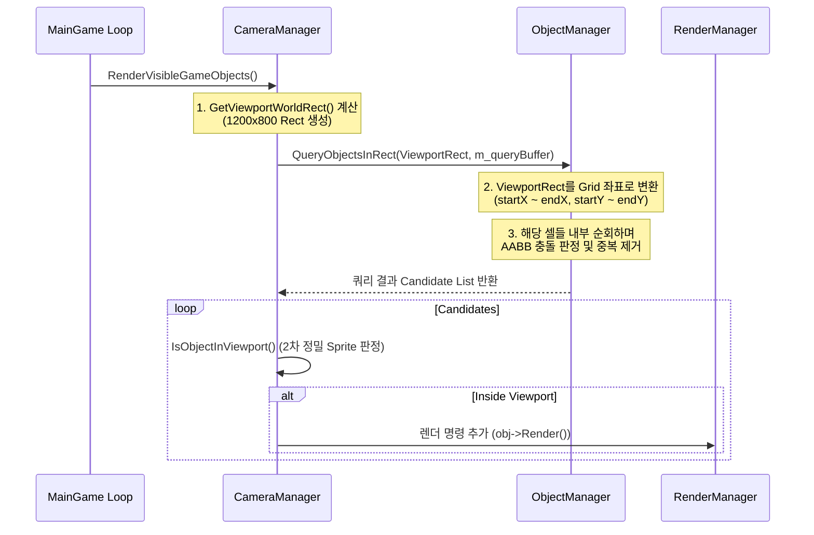

# 그리드 공간 분할 기반 뷰포트 컬링 및 렌더링 시스템

본 문서는 `DontStarve_WinApi` 프로젝트에서 카메라 가시 영역(Viewport) 내의 객체들만 효율적으로 판정하여 렌더링하는 **공간 분할(Spatial Partitioning) 및 뷰포트 컬링(Viewport Culling) 시스템**의 설계와 구현 방식을 정리합니다.

---

## 1. 개요 및 핵심 개념

### 1.1 필요성: O(N) 브루트 포스 방지
월드에 수천 개의 오브젝트(캐릭터, 나무, 자원, 타일 등)가 존재할 때, 매 프레임 모든 오브젝트의 렌더링 함수(`Render()`)를 호출하는 것은 극히 비효율적입니다. CPU-GPU 연산 낭비뿐만 아니라 GDI+ API 호출 오버헤드가 발생합니다.
* **비최적화**: 월드 오브젝트 목록을 전체 순회하며 그리기 ($O(N)$)
* **최적화**: 현재 카메라가 비추고 있는 화면 영역(Viewport)에 닿아 있는 셀만 타겟팅하여 그리기 ($O(K)$, $K$는 화면 근처의 일부 오브젝트 수)

### 1.2 핵심 상수 설정 ([Define.h](file:///E:/Project/DontStarve_WinAPI/DontStarve_WinApi/Header/Define.h))
* 화면 해상도 (`WINCX`, `WINCY`): $1200 \times 800$ 픽셀
* 기본 타일 크기 (`TILE_SIZE`): $128 \times 128$ 픽셀
* 공간 격자 크기 (`GRID_CELL_SIZE`): $256 \times 256$ 픽셀 (타일 $2 \times 2$ 크기)
* 월드 맵 크기: $100 \times 100$ 타일 ($12,800 \times 12,800$ 픽셀)
* 그리드 분할 해상도:
  $$\text{GRID\_WIDTH} = \frac{100 \times 128}{256} + 2 = 52$$
  $$\text{GRID\_HEIGHT} = \frac{100 \times 128}{256} + 2 = 52$$
  * 총 $52 \times 52 = 2,704$개의 셀로 월드 공간을 분할 관리합니다.

---

## 2. 주요 컴포넌트의 역할

### 2.1 [ObjectManager](file:///E:/Project/DontStarve_WinAPI/DontStarve_WinApi/DontStarve_Client/01_Manager/ObjectManager/ObjectManager.h)
* 월드에 존재하는 모든 게임 오브젝트의 생명주기를 관리합니다.
* $52 \times 52$ 2차원 포인터 배열 `m_spatialGrid`를 보유하여 공간 분할 그리드를 형성합니다.
* 오브젝트의 위치 변화에 따라 소속 그리드를 실시간으로 갱신합니다.

### 2.2 [CameraManager](file:///E:/Project/DontStarve_WinAPI/DontStarve_WinApi/DontStarve_Client/01_Manager/CameraManager/CameraManager.h)
* 현재 플레이어를 추적(`FollowTarget`)하고 카메라 뷰포트 좌표를 유지합니다.
* 뷰포트 사각형 영역(`Gdiplus::RectF`)을 생성하여 [ObjectManager](file:///E:/Project/DontStarve_WinAPI/DontStarve_WinApi/DontStarve_Client/01_Manager/ObjectManager/ObjectManager.h)에게 영역 쿼리를 요청합니다.
* 쿼리 버퍼(`m_queryBuffer`)를 재사용하여 동적 메모리 할당 비용을 배제합니다.
* 반환받은 최종 가시 오브젝트들의 `Render()`를 프레임마다 순차적으로 실행합니다.

---

## 3. 상세 렌더링 및 컬링 파이프라인

게임의 메인 루프에서 가시 객체들이 화면에 그려지기까지는 다음의 흐름을 거칩니다.



### 3.1 단계 1: 카메라 뷰포트 영역 계산
[CameraManager::GetViewportWorldRect](file:///E:/Project/DontStarve_WinAPI/DontStarve_WinApi/DontStarve_Client/01_Manager/CameraManager/CameraManager.cpp#L58-L62) 함수가 호출되어 월드 기준 카메라의 가시 사각형 영역을 도출합니다.
```cpp
Gdiplus::RectF CameraManager::GetViewportWorldRect() const {
	const float halfW = static_cast<float>(WINCX) * 0.5f; // 600
	const float halfH = static_cast<float>(WINCY) * 0.5f; // 400
	return { m_cameraPos.X - halfW, m_cameraPos.Y - halfH, static_cast<float>(WINCX), static_cast<float>(WINCY) };
}
```

### 3.2 단계 2: 그리드 범위 변환 및 1차 컬링
[ObjectManager::QueryObjectsInRect](file:///E:/Project/DontStarve_WinAPI/DontStarve_WinApi/DontStarve_Client/01_Manager/ObjectManager/ObjectManager.cpp#L174-L227)는 뷰포트 사각형 영역(`rect`)을 입력받아 격자 인덱스로 매핑합니다.
* **인덱스 계산**:
  $$\text{startX} = \lfloor \text{rect.X} / 256 \rfloor, \quad \text{startY} = \lfloor \text{rect.Y} / 256 \rfloor$$
  $$\text{endX} = \lceil (\text{rect.X} + 1200) / 256 \rceil - 1, \quad \text{endY} = \lceil (\text{rect.Y} + 800) / 256 \rceil - 1$$
* 계산된 범위는 안전하게 `[0, GRID_WIDTH - 1]` 범위로 클램핑 처리됩니다.

### 3.3 단계 3: 중복 제거 및 AABB 교집합 검사
1차 추출된 셀 영역 `[startX ~ endX][startY ~ endY]` 안의 오브젝트 리스트를 순회합니다.
1. **스탬프 중복 검사**: 쿼리 시점마다 `m_spatialQueryStamp` 값을 `+1` 증가시킵니다. 이미 동일 스탬프를 찍은 오브젝트는 검사를 패스하여 중복 연산을 원천 차단합니다.
2. **AABB 충돌 판정**: 오브젝트의 실제 Bounds(`obj->GetBounds()`)와 카메라 Viewport Rect 간의 사각형 겹침(AABB)을 최종 계산합니다.
```cpp
if (rect.X < bounds.X + bounds.Width && rect.X + rect.Width > bounds.X &&
    rect.Y < bounds.Y + bounds.Height && rect.Y + rect.Height > bounds.Y) {
    outObjects.push_back(obj);
}
```

### 3.4 단계 4: 2차 정밀 컬링 및 최종 렌더링
[CameraManager::RenderVisibleGameObjects](file:///E:/Project/DontStarve_WinAPI/DontStarve_WinApi/DontStarve_Client/01_Manager/CameraManager/CameraManager.cpp#L183-L288)에서 반환받은 후보군을 한 번 더 미세 필터링합니다.
* **정밀 스프라이트 판정**: [CameraManager::IsObjectInViewport](file:///E:/Project/DontStarve_WinAPI/DontStarve_WinApi/DontStarve_Client/01_Manager/CameraManager/CameraManager.cpp#L358-L409)를 활용하여, Sprite Pivot 및 Scale이 반영된 **실제 렌더링 영역(Render Bounds)** 기준으로 가시 영역 판단을 최종 통과한 것들만 그리기 명령에 할당합니다.
```cpp
// CameraManager.cpp 발췌
for (GameObject* obj : visibleBuffer) {
    obj->Render(); // 렌더러에 등록
    obj->RenderDebugOverlay();
#ifdef _DEBUG
    RenderManager::GetInstance()->AddRenderedObject(obj->IsEntity());
#endif
}
```

---

## 4. 성능 극대화를 위한 최적화 기법들

### 4.1 쿼리 버퍼 재사용 (Allocation Free)
매 프레임 `vector` 객체를 생성/소멸하는 것은 힙 단편화와 동적 할당 오버헤드를 유발합니다.
* `CameraManager`는 멤버 변수 `m_queryBuffer`를 활용하며, `Init()` 시점에 **`m_queryBuffer.reserve(2048)`**를 호출하여 사전 할당을 진행합니다.
* 매 프레임 `clear()`만 호출하여 메모리 캐시 메모리 주소를 그대로 유지한 채 데이터를 채워 넣습니다.
* 디버그 모드의 `g_bEnableBufferReuse` 스위치를 제공하여 성능 차이를 정량적으로 측정할 수 있도록 구성되어 있습니다.

### 4.2 타일 컬링 및 캐싱
게임의 밑바닥을 이루는 Static Tile 역시 뷰포트 영역을 기준으로 컬링하여 렌더 커맨드를 구성합니다.
* **타일 컬링**: `CameraManager::RenderVisibleTiles()`에서 타일 기준 뷰포트 영역(마진 8픽셀 부여)을 계산하여 가시 영역에 들어오는 타일 번호만 렌더러에 등록합니다.
* **타일 캐시 관리**: `m_tileCache` 구조를 활용하여 불필요한 타일 비트맵을 제거하고, 뷰포트에서 완전히 벗어난 캐시는 `CleanupUnusedTileCache()`를 통해 소멸시켜 메모리 오버헤드를 관리합니다.

### 4.3 오브젝트 그리드 셀 갱신
오브젝트가 월드를 이동할 때마다 실시간으로 해당 공간 그리드가 자동으로 동기화됩니다.
* **갱신 방식**: [ObjectManager::UpdateObjectGridCell](file:///E:/Project/DontStarve_WinAPI/DontStarve_WinApi/DontStarve_Client/01_Manager/ObjectManager/ObjectManager.cpp#L229-L258)에서 오브젝트의 중심좌표를 기반으로 소속 셀 위치(X, Y)를 실시간 연산합니다.
* **비용 최소화**: 연산한 결과가 기존 셀 좌표(`GetGridCellX()`, `GetGridCellY()`)와 동일하다면, 그리드 리스트 변경 작업 없이 즉시 조기 종료(`return`)하여 갱신 비용을 $O(1)$로 제어합니다.

---

## 5. 관련 문서 링크
* **공간 분할 세부 구현**: [Spatial_Partitioning_Detailed.md](file:///E:/Project/DontStarve_WinAPI/DontStarve_WinApi/Docs/Spatial_Partitioning_Detailed.md)
* **쿼리 및 렌더링 성능 최적화 가이드**: [Query_and_Rendering_Optimization.md](file:///E:/Project/DontStarve_WinAPI/DontStarve_WinApi/Docs/Query_and_Rendering_Optimization.md)
